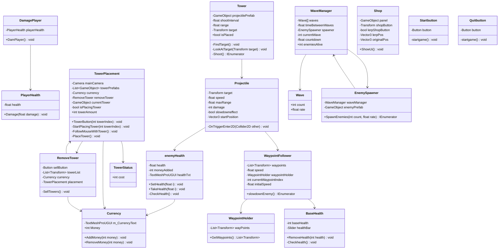

Opdracht 1 Functions, Methods, Parameters & return type

ik heb er voor gezorgd dat er allemaal verschillende kleuren balletjes spawnen

technische uitdaging was de opdracht in het algemeen

https://github.com/Flyboyace/Prog-opdrachten-M5/blob/main/Ballspawner

Opdracht 2 Class, Object, Constructor & Instantiate

technische uitdaging was de opdracht in het algemeen

https://github.com/Flyboyace/Prog-opdrachten-M5/blob/main/Tower

https://github.com/Flyboyace/Prog-opdrachten-M5/blob/main/TowerSpawner

Opdracht 3 List en loop

technische uitdaging was de opdracht in het algemeen

https://github.com/Flyboyace/Prog-opdrachten-M5/blob/main/Enemy

https://github.com/Flyboyace/Prog-opdrachten-M5/blob/main/Enemyspawner

Opdracht 4: Action Events

technische uitdaging was de opdracht in het algemeen

https://github.com/Flyboyace/Prog-opdrachten-M5/blob/main/Pickup

https://github.com/Flyboyace/Prog-opdrachten-M5/blob/main/Playermovement

https://github.com/Flyboyace/Prog-opdrachten-M5/blob/main/Scoreboard

Opdracht 6: SRP

technische uitdaging was het clonen van de repo

https://github.com/Flyboyace/Prog-opdrachten-M5/blob/main/Laserbehavior

https://github.com/Flyboyace/Prog-opdrachten-M5/blob/main/Shipbehaviour

https://github.com/Flyboyace/Prog-opdrachten-M5/blob/main/Shipinventory

https://github.com/Flyboyace/Prog-opdrachten-M5/blob/main/Shipmovement

https://github.com/Flyboyace/Prog-opdrachten-M5/blob/main/Shipshooting

https://github.com/Flyboyace/Prog-opdrachten-M5/blob/main/ShipUI

M6 
Opdracht 1: Code conventions

https://github.com/Flyboyace/Prog-opdrachten-M5/blob/main/Inventory%20item

https://github.com/Flyboyace/Prog-opdrachten-M5/blob/main/Weapon

Opdracht 2: Class Diagram van je TD project

Link naar TD project voor code.
https://github.com/Flyboyace/BO-tower-defense

Opdracht 3: Data structures

Opdracht 4: Score Collection Game

